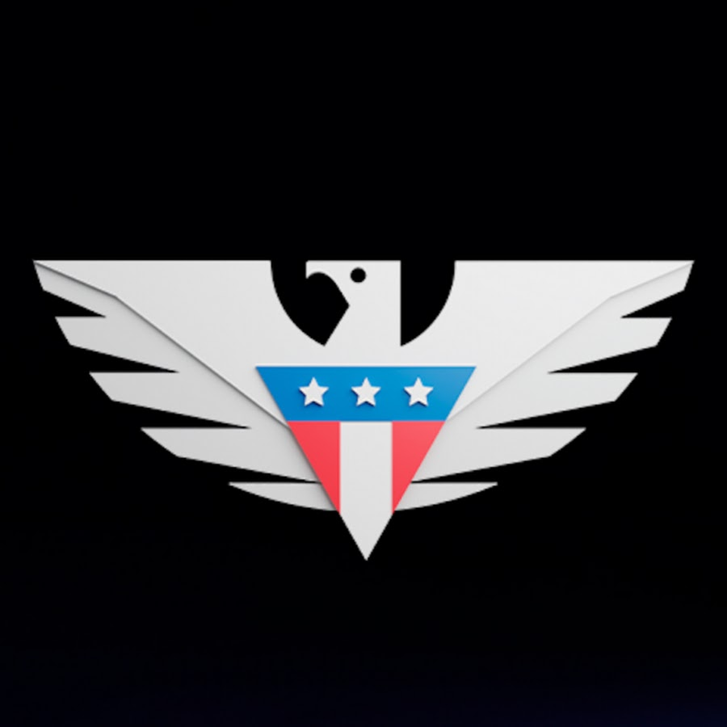
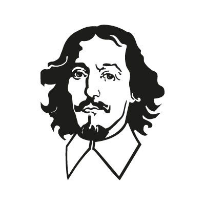

  

    

      <h1>Hamzauddin Siddiqui</h1>
      
Welcome to my portfolio! I'm a data analyst with expertise in SQL, Python, Tableau, and business intelligence, currently pursuing my Master's in Operations Research & Business Analytics in Germany. I specialize in turning complex data into clear, actionable business insights.

      
      

        <a href="https://www.linkedin.com/in/hamzauddinsiddiqui-786180175" target="_blank" class="btn-primary">LinkedIn</a>
        <a href="{{ '/Hamzauddin_Siddiqui_CV.pdf' | relative_url }}" target="_blank" class="btn-secondary">Download CV</a>
      

    

    

      
    

  

[Rest of your existing content - work experience and education sections...]

## Work Experience

  

    

      
    

    

      <h3>User Insight and Support</h3>
      <h4>Bettermile</h4>
      
December 2024 - Present (9 months)

      
Berlin, Germany • Full-Time

    

  

  

    

      
    

    

      <h3>Product Experience Analyst</h3>
      <h4>US Mobile</h4>
      
June 2023 - February 2024 (9 months)

      
Karachi, Pakistan • Full-Time

    

  

  

    

      
    

    

      <h3>Business Intelligence Specialist</h3>
      <h4>Swvl</h4>
      
February 2021 - August 2021 (7 months)

      
Karachi, Pakistan • Full-Time

      

        <h3>Treasury and Taxation Specialist</h3>
        
September 2020 - January 2021 (5 months)

        
Karachi, Pakistan • Full-Time

      

    

  

  

    

      
    

    

      <h3>Product Development Intern</h3>
      <h4>Meezan Bank Limited</h4>
      
June 2019 - August 2019 (3 months)

      
Karachi, Pakistan • Internship

    

  

  

    

      
    

    

      <h3>Summer Finance Intern</h3>
      <h4>Standard Chartered Bank</h4>
      
June 2013 - July 2013 (2 months)

      
Karachi, Pakistan • Internship

    

  

## Education

  

    

      
    

    

      <h3>Master of Science - MS, Operations Research and Business Analytics</h3>
      <h4>Otto-von-Guericke University Magdeburg</h4>
      
April 2024 - August 2026

    

  

  

    

      
    

    

      <h3>Erasmus+, Study Abroad Exchange Program</h3>
      <h4>University of Ljubljana, School of Economics and Business</h4>
      
February 2025 - July 2025

    

  

  

    

      
    

    

      <h3>ACCA, Accounting and Finance</h3>
      <h4>ACCA</h4>
      
September 2020 - June 2025

    

  

  

    

      
    

    

      <h3>Bachelor's degree, Accounting and Finance</h3>
      <h4>Institute of Business Administration</h4>
      
2016 - 2020 • CGPA: 3.42

    

  

<!-- Modal Structure -->

  

    &times;
    

  

